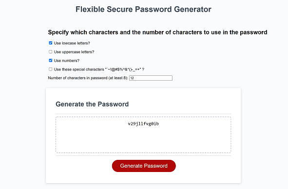

# SecPassGen - A generator for secure passwords
## Description
The web page generates a password composed of random symbols. The random symbols will make the password impossible to guess. The user can choose which types of symbols to use in the password:
- Lower case letters
- Upper case letters
- Special characters `~!@#$%^&*()-_=+
- Numbers
</ul>
The button that the user clicks to generate the password is disabled until the user enters a number 8 or greater.
This program uses HTML and JavaScript. The JavaScript uses event listeners and the random number generator that generates a uniformally distributed number between 0 and 1, inclusive.

## Installation
The source code is in this GitHub repository: https://github.com/minprocess/03-SecPassGen
This project can be edited and run using Visual Studio Code. No libraries need to be installed.

## Usage
Link to GitHub pages: https://minprocess.github.io/03-SecPassGen/
To use this web page, click on a check box for at least one of 4 types of characters (lower case, upper case, special characters and numbers) and enter a number 8 or greater for the number of characters in the generated password.
If user clicks the Generate Password button but none of the checkboxes for type of character have been check then this alert appears.
  

  
It would be better to not enable the button until one of the checkboxes are checked.
Here is a screenshot of this web page
  

  
## Suggested Improvements
1. Generate Password button should be disabled if none of the character-type checkboxes are checked.
2. Generate Password button should be disabled if the number of characters is higher than some max value. I think a max of 40 characters should be sufficient for extremely secure passwords.

## License
MIT License

Copyright (c) 2021 William T. Pate

Permission is hereby granted, free of charge, to any person obtaining a copy
of this software and associated documentation files (the "Software"), to deal
in the Software without restriction, including without limitation the rights
to use, copy, modify, merge, publish, distribute, sublicense, and/or sell
copies of the Software, and to permit persons to whom the Software is
furnished to do so, subject to the following conditions:

The above copyright notice and this permission notice shall be included in all
copies or substantial portions of the Software.

THE SOFTWARE IS PROVIDED "AS IS", WITHOUT WARRANTY OF ANY KIND, EXPRESS OR
IMPLIED, INCLUDING BUT NOT LIMITED TO THE WARRANTIES OF MERCHANTABILITY,
FITNESS FOR A PARTICULAR PURPOSE AND NONINFRINGEMENT. IN NO EVENT SHALL THE
AUTHORS OR COPYRIGHT HOLDERS BE LIABLE FOR ANY CLAIM, DAMAGES OR OTHER
LIABILITY, WHETHER IN AN ACTION OF CONTRACT, TORT OR OTHERWISE, ARISING FROM,
OUT OF OR IN CONNECTION WITH THE SOFTWARE OR THE USE OR OTHER DEALINGS IN THE
SOFTWARE.

## Badges

## Tests
1. Click one or more of the checkboxes. Enter the desired number of characters, greater than 8 and click the Generate Password button. Are the correct number of characters generated? Are all of the characters of the type specified by the checkboxes that were checked?
2. Is the Generate Password button disabled if there is no number in the textbox or if there is, is it less than 8?
3. Type a character that is not a number. Does the Generate Password button disable?
